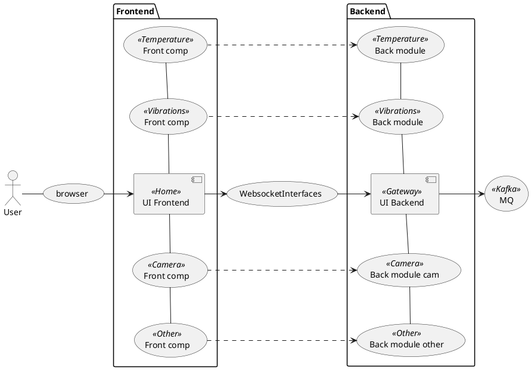

# Проект Датана.Смарт.UI

Это проект интерфейса пользователя для Датана-Смарт.

## Структура проекта



## Модули

1. [`dmart-common`](dsmart-common/README.md) - главный компонент интерфейса пользователя, который управляет всеми 
компонентами UI.
1. [`dmart-ui-main`](dsmart-ui-main/README.md) - корневой компонент (Home) интерфейса пользователя, который управляет всеми 
компонентами UI.
1. [`dmart-module-temperature`](dsmart-module-temperature/README.md) - модуль для датчика температуры

## Сборка и деплой проекта

Компиляция проекта:
```bash
./gradlew build
```

Локальное построение образа:
```bash
# Опционально. При наличии, будет в 
export DOCKER_REGISTRY_HOST=registry.datana.ru

./gradlew build
```

Деплой проекта в реестр докеров:
```bash
#export DOCKER_REGISTRY_PORT=
export DOCKER_REGISTRY_HOST=registry.datana.ru
export DOCKER_REGISTRY_USER=admin
export DOCKER_REGISTRY_PASS=*****
./gradlew deploy
```

## Запуск проекта

Из докера:
```bash
 docker run -p 8080:8080 
```
