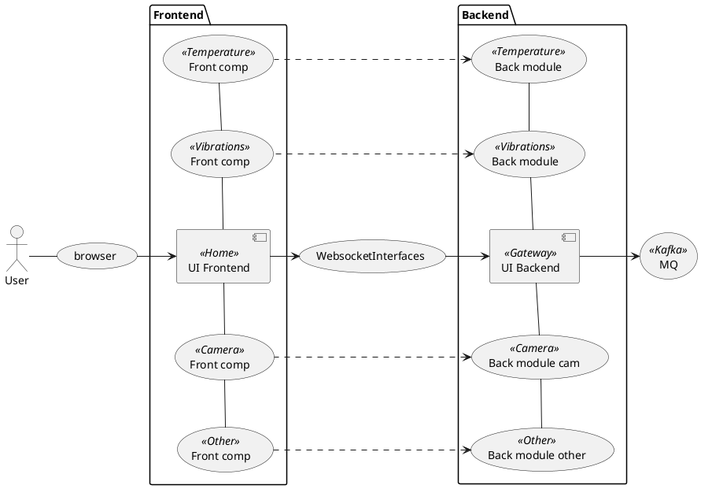

# Проект Датана.Смарт.UI

Это проект интерфейса пользователя для Датана-Смарт.

## Структура проекта



## Модули

1. [`dmart-common`](dsmart-common/README.md) - главный компонент интерфейса пользователя, который управляет всеми 
компонентами UI.
1. [`dmart-ui-main`](dsmart-ui-main/README.md) - корневой компонент (Home) интерфейса пользователя, который управляет всеми 
компонентами UI.
1. [`dmart-module-temperature`](dsmart-module-temperature/README.md) - модуль для датчика температуры

## Сборка и деплой проекта

Компиляция проекта:
```bash
./gradlew build
```

Локальное построение образа:
```bash
# Опционально. При наличии, будет в 
export DOCKER_REGISTRY_HOST=registry.datana.ru

./gradlew build
```

Деплой проекта в реестр докеров:
```bash
#export DOCKER_REGISTRY_PORT=
export DOCKER_REGISTRY_HOST=registry.datana.ru
export DOCKER_REGISTRY_USER=admin
export DOCKER_REGISTRY_PASS=*****
./gradlew deploy
```

## Запуск проекта

Из докера:
```bash
 docker run -p 8080:8080
```

## Переменные окружения

```bash
export KAFKA_BOOTSTRAP_SERVERS=kafka-server1:9092
export KAFKA_GROUP_ID
#export KAFKA_CLIENT_ID
export KAFKA_TOPIC_RAW=ui-temperature
export KAFKA_TOPIC_ANALYSIS=temperature-ui-ml
export SENSOR_ID=8e630dd0-5796-45e0-8d85-8a14c5d872dd
```
Дополнительные переменные см. в [datana-smart-logger](https://gitlab.dds.lanit.ru/datana_smart/datana-smart-common/datana-smart-logging#%D0%BF%D0%B5%D1%80%D0%B5%D0%BC%D0%B5%D0%BD%D0%BD%D1%8B%D0%B5-%D0%BE%D0%BA%D1%80%D1%83%D0%B6%D0%B5%D0%BD%D0%B8%D1%8F-%D1%84%D0%B0%D0%B9%D0%BB%D0%B0-logbackxml)

