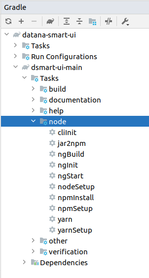

# Главное фронтенд-приложение

Этот проект содержит главное приложение пользовательского интерфейса.
Реализация на Angular. Не должно содержать конкретные реализации
виджетов, но должно содержать позиционирование виджетов.

Виджеты должны быть выделены в отдельные подпроекты этого репозитария.
В перспективе они могут переехать в отдельные репозитарии.

## Назначение

Проект предназначен генерации дистрибутива, который будет деплоиться на
сервера заказчика. Приложение будет заниматься инфраструктурными задачами:
1. Управление размещением виджетов в окне пользователя
2. Проброс параметров из контейнера вплоть до дочерних компонентов
3.  

## Работа с модулем
Это стандартный nodeJs модуль. Но для его сборки используетсяы Gradle.
Для того, чтоб его использовать следует использовать соответсвующие таски (см.далее)
Таски запускаются следующим образом.

### В консоли
```bash
./gradlew :dsmart-ui-main:<task>
```

### В Idea


### Доступные таски
1. ngBuil - Компиляция дистрибутива в директорию dist/dsmart-ui-main
1. ngStart - запуск приложения локально на адресе http://localhost:4200
1. ngImage - подготовка Docker-образа (_не готово_)
1. ngDeploy - публикация Docker-образа в Docker-реестре (_не готово_)

#Инструкция по настройке профилей npm и их использованию, у меня на windows почему то не заработало
https://docs.npmjs.com/configuring-your-registry-settings-as-an-npm-enterprise-user

#Инструкция по настройке профиля npm для загрузки и выгрузки библиотек в nexus
Необходимо в корне проекта создать файл .npmrc и добавить в него следующую строку:
```aidl
registry=http://nexus.datana.ru:8081/repository/npm-private/
_auth=YWRtaW46YWRtaW4xMjM=
```
где YWRtaW46YWRtaW4xMjM= кодированный логин и пароль admin/admin123, для использования дроугого пароля к его необходимо кодировать в base64.

Для использования глобального npm репозитория необходимо удалить эту строку из файла.
